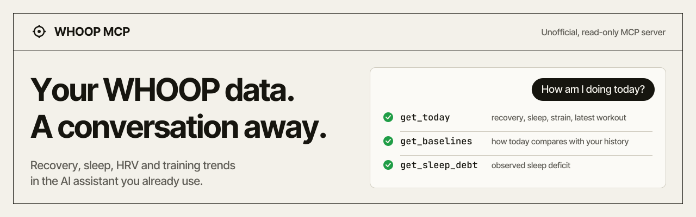
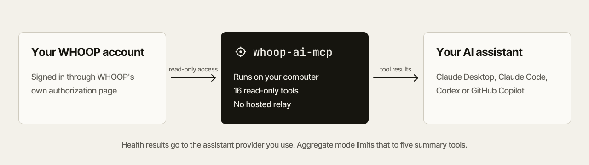

<picture>
	<source media="(prefers-color-scheme: dark)" srcset="images/readme/banner-dark.svg">
	
</picture>

<p align="center">
	<a href="https://www.npmjs.com/package/whoop-ai-mcp"></a>
	<a href="https://www.npmjs.com/package/whoop-ai-mcp"></a>
	<a href="https://github.com/shashankswe2020-ux/whoop-mcp/stargazers"></a>
	<a href="LICENSE"></a>
</p>

**whoop-ai-mcp** is a read-only [WHOOP](https://www.whoop.com/) [MCP server](https://modelcontextprotocol.io/) for Claude Desktop, Claude Code, Codex and GitHub Copilot. Ask about your recovery, compare weeks of sleep, or check today against your own baseline, without exporting the data yourself.

```bash
npx -y whoop-ai-mcp@latest setup --client=claude-desktop
```

<p align="center">
	<a href="#quickstart"><strong>Quickstart</strong></a>&ensp;|&ensp;<a href="https://youtu.be/2vwxEjctcWs">Watch the walkthrough</a>&ensp;|&ensp;<a href="https://whoopconnector.com/">Website</a>&ensp;|&ensp;<a href="references/tools.md">Tool reference</a>
</p>

<p align="center">
	
	<br><sub>Claude Desktop builds the review; whoop-ai-mcp supplies the data. Your results and layout will differ.</sub>
</p>

## Ask your WHOOP data anything

| Ask | You get |
|-----|---------|
| **"How am I doing today?"** | Recovery, primary sleep, strain and your latest workout, with gaps flagged where data is missing |
| **"Is my HRV unusual for me?"** | Your personal baseline: distribution, percentiles and how many days it's based on |
| **"How did my sleep change this month?"** | Trends, period-to-period comparisons, sleep debt and consistency |
| **"Give me my weekly health review."** | Recovery, sleep and training in one summary |

Statistics describe your recorded history. They aren't medical diagnoses or predictions.

## Quickstart

**You need:** Node.js 20 or later, an active WHOOP membership, and a [WHOOP Developer App](https://developer.whoop.com) with the redirect URL `http://localhost:3000/callback`.

1. **Set up.** Run the command for your assistant and enter your developer app's client ID and secret when asked.

   | Assistant | Command |
   |-----------|---------|
   | Claude Desktop | `npx -y whoop-ai-mcp@latest setup --client=claude-desktop` |
   | Claude Code | `npx -y whoop-ai-mcp@latest setup --client=claude-code` |
   | Codex | `npx -y whoop-ai-mcp@latest setup --client=codex` |
   | GitHub Copilot | `npx -y whoop-ai-mcp@latest setup --client=copilot` |

   For Claude Code, Codex and Copilot, run the registration command that setup prints. Nothing is installed globally, and optional usage telemetry defaults to **No**.

2. **Authorize.** Fully quit and reopen your assistant. The first time the server starts, WHOOP opens in your browser so you can approve access.

3. **Ask.** Try *"Summarize my sleep and recovery this week."*

Need manual configuration, environment variables or a remote deployment? See the [full setup guide](references/installation.md).

<details>
<summary><strong>Prefer a native binary?</strong></summary>
<br>

The [Rust implementation](https://github.com/shashankswe2020-ux/whoop-mcp-rs) supports the same four assistants without a Node.js runtime. It needs Rust 1.88 or later:

```bash
cargo install whoop-mcp
whoop-mcp setup --client=claude-desktop
```

</details>

## How it works

<picture>
	<source media="(prefers-color-scheme: dark)" srcset="images/readme/how-it-works-dark.svg">
	
</picture>

- **Read-only.** The server has no tools that create, change or delete anything in your WHOOP account.
- **Local by default.** The server runs on your machine. No hosted relay is involved.
- **Your assistant sees the results.** Health data reaches the assistant provider you use, the same as anything else you share in that chat.
- **Aggregate mode** limits the server to five summary tools and hides per-record data. It reduces what's shared, but it isn't anonymization.
- **Telemetry is off unless you opt in.** It never includes health data or chat text.

Details: [data handling](references/privacy.md) and [telemetry controls](references/telemetry.md).

## What's included

In standard mode, the server provides **16 read-only tools, 4 resources and 5 prompt templates**. Support for resources, prompts and remote connections depends on your assistant.

<details>
<summary><strong>See all tools and prompts</strong></summary>
<br>

| Group | Tools |
|-------|-------|
| Today and baselines | `get_today`, `get_baselines`, `get_sleep_debt` |
| Trends and reviews | `get_weekly_summary`, `get_trend`, `compare_periods`, `get_calendar` |
| Records | `get_recovery_collection`, `get_sleep_collection`, `get_workout_collection`, `get_cycle_collection`, `get_sleep_by_id`, `get_workout_by_id`, `get_cycle_by_id` |
| Profile | `get_profile`, `get_body_measurement` |

**Prompt templates:** `weekly_health_review`, `sleep_analysis`, `recovery_trend`, `workout_recap`, `health_check`

Parameters, date expressions, resources and caching are in the [tool reference](references/tools.md).

</details>

## Documentation

| Guide | What's in it |
|-------|--------------|
| [Installation](references/installation.md) | Assistants, manual configuration, environment variables and WHOOP authorization |
| [Tool reference](references/tools.md) | Every tool and its parameters, date expressions, resources, prompts and caching |
| [Privacy](references/privacy.md) | Structured results, aggregate mode and what your assistant provider receives |
| [Telemetry](references/telemetry.md) | Consent, opting out, what's collected and how long it's kept |
| [Troubleshooting](references/troubleshooting.md) | Local diagnostics, common errors and MCP Inspector |
| [Deployment](references/deployment.md) | Docker, cloud hosting and remote connector OAuth |
| [Development](references/development.md) | Tests, project structure and release workflow |
| [Background](references/background.md) | Ecosystem research and the video walkthrough |

What changed recently? See the [changelog](CHANGELOG.md) or the [latest release](https://github.com/shashankswe2020-ux/whoop-mcp/releases/latest).

## Contributing

Found a useful question, a missing workflow or a bug? [Open an issue](https://github.com/shashankswe2020-ux/whoop-mcp/issues/new/choose) or read the [contributing guide](CONTRIBUTING.md). Please never include credentials or health records in a public report; security problems go through the [security policy](SECURITY.md). Everyone taking part follows the [Code of Conduct](CODE_OF_CONDUCT.md).

If whoop-ai-mcp is useful to you, a GitHub star helps other people find it, and you can [buy me a coffee](https://buymeacoffee.com/shashanksw9) to support development.

<details>
<summary><strong>Project growth</strong></summary>
<br>

<p align="center">
	<a href="https://www.star-history.com/#shashankswe2020-ux/whoop-mcp&Date">
		
	</a>
</p>

<p align="center">
	<a href="https://npm-history.pages.dev/?package=whoop-ai-mcp&amp;start=2026-04-11&amp;mode=cumulative">
		<picture>
			<source media="(prefers-color-scheme: dark)" srcset="https://npm-history.pages.dev/svg?package=whoop-ai-mcp&amp;start=2026-04-11&amp;mode=cumulative&amp;theme=dark">
			<source media="(prefers-color-scheme: light)" srcset="https://npm-history.pages.dev/svg?package=whoop-ai-mcp&amp;start=2026-04-11&amp;mode=cumulative&amp;theme=light">
			
		</picture>
	</a>
	<br><sub>Downloads include automated installs and may not represent unique users.</sub>
</p>

</details>

## License

[MIT](LICENSE). This is an unofficial project and isn't affiliated with WHOOP. A WHOOP membership and API access are separate from this package.
